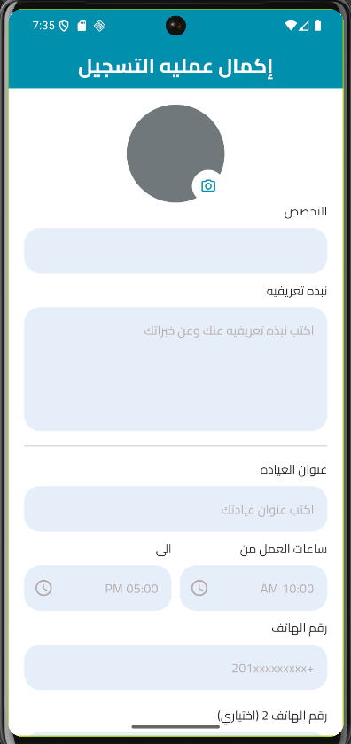

# Se7ety App

Se7ety is a Flutter healthcare application built as part of my Flutter course.

This README documents the project after **Session 27**, where the app was extended beyond the patient-side flow by adding the first doctor-side profile completion screen.

The project now includes Firebase Authentication, Cloud Firestore integration, local persistence using SharedPreferences, onboarding flow, patient main layout, patient home screen, and a prepared doctor registration completion UI.

The code is organized using a feature-based structure with reusable widgets, centralized styling, GoRouter navigation, Cubit state management, and clean separation between UI, logic, models, services, and shared components.

---

## Session 27 Scope

Session 27 focused on adding the first doctor-specific registration completion experience after the basic authentication flow.

Implemented in this session:

- Added Doctor Registration Completion Screen
- Added profile picture UI section
- Added working hours reusable section
- Added doctor specialization list model
- Extended DoctorModel with more doctor profile fields
- Extended AuthCubit with doctor profile controllers
- Added a dedicated GoRouter route for doctor registration completion
- Updated Splash Screen navigation for logged-in users
- Enhanced CustomTextFormField to support multiline fields and suffix icons
- Added the new doctor registration screenshot to the README

---

## Features

### Splash Screen

- Displays the app logo
- Waits briefly before navigating
- Decides the next screen based on the current app state:
  - If the user is already logged in, it opens the Doctor Registration Completion Screen
  - If onboarding has already been shown, it opens the Welcome Screen
  - Otherwise, it opens the Onboarding Screen

### Onboarding Flow

- Built using PageView
- Contains 3 onboarding pages
- Uses Cubit to track the current page
- Displays a custom onboarding indicator
- Changes the button text on the last page
- Saves onboarding state locally using SharedPreferences
- Navigates to the Welcome Screen after completion

### Welcome Screen

- Introduces the app to the user
- Allows choosing the account type:
  - Doctor
  - Patient
- Passes the selected user type to the authentication screens

### Register Screen

- Displays dynamic text based on the selected user type
- Includes:
  - Name field
  - Email field
  - Password field
- Validates all inputs before submitting
- Creates the account using Firebase Authentication
- Saves basic user data in Cloud Firestore
- Saves the user ID locally using SharedPreferences
- Shows loading and error feedback using reusable dialogs

### Login Screen

- Displays dynamic text based on the selected user type
- Includes:
  - Email field
  - Password field
  - Forgot password button UI
  - Google button placeholder
- Validates form inputs before login
- Logs the user in using Firebase Authentication
- Saves the user ID locally using SharedPreferences
- Navigates after successful login
- Shows loading and error feedback using reusable dialogs

### Authentication Logic

Authentication is managed using AuthCubit.

AuthCubit currently handles:

- Loading state
- Success state
- Error state
- Register controllers
- Login controllers
- Doctor profile completion controllers prepared for future saving logic

This keeps business logic separated from UI and makes the authentication flow easier to maintain and extend.

### Firestore Integration

The app stores user data in separate Firestore collections:

- doctors
- patients

Firestore operations are handled through FirestoreProvider.

Current Firestore methods:

- addPatient()
- addDoctor()

### User Models

The project includes two main user models:

- DoctorModel
- PatientModel

DoctorModel now includes doctor-specific fields such as:

- uid
- name
- image
- specialization
- rating
- email
- phone1
- phone2
- bio
- openHour
- closeHour
- address

PatientModel includes patient profile fields such as:

- uid
- name
- image
- age
- email
- phone
- gender
- bio
- city

Both models include:

- fromJson()
- toJson()
- toUpdateData()

This prepares the project for future profile editing and Firestore update operations.

### Doctor Registration Completion Screen

A new Doctor Registration Completion Screen was added in Session 27.

This screen is prepared to collect additional doctor profile data after the basic account registration step.

It currently includes:

- Profile picture section
- Specialization field
- Bio field
- Clinic address field
- Working hours section
- Primary phone number field
- Optional secondary phone number field
- Submit button UI

The screen is currently UI-ready and prepared for the next step, which is saving the completed doctor profile data to Firestore.

### Profile Picture Section

A reusable ProfilePicSection widget was added.

It currently includes:

- Circular avatar placeholder
- Camera icon button
- Clean layered Stack design
- Styling based on the project color system

This section prepares the app for future image picker and profile image upload functionality.

### Working Hours Section

A reusable WorkingHoursSection widget was added.

It includes:

- Opening time field
- Closing time field
- Time icons
- Responsive Row layout using Expanded widgets
- Shared CustomTextFormField usage

This keeps the doctor profile form cleaner and separates repeated UI from the main screen file.

### Doctor Specializations

A specializations list was added to prepare the app for doctor category selection.

Current specializations include:

- أسنان
- جلدية
- عظام
- أطفال
- باطنة
- نفسية
- أذن أنف حنجرة
- قلب
- مسالك بولية
- رمد

This list can later be connected to a dropdown, autocomplete field, or Firestore-driven specialization source.

### Patient Main App Layout

A patient-side main layout was added using bottom navigation.

Current tabs:

- Home
- Search
- Appointments
- Profile

At this stage, the Home screen is implemented, while the other tabs are prepared as placeholders for future sessions.

### Patient Home Screen

The Patient Home Screen includes:

- App bar with app title
- Notification icon
- Greeting section
- Search field
- Horizontal specialties section
- Top-rated doctors section
- Reusable specialty cards
- Reusable doctor cards

### Local Persistence

The app uses SharedPreferences to store:

- Whether onboarding has already been shown
- The currently logged-in user ID

This improves the user experience by avoiding repeated onboarding and supporting returning-user navigation.

### Reusable Components

The app uses reusable shared widgets and helpers, such as:

- AppButton
- CustomTextFormField
- PasswordTextFormField
- AuthFooter
- UserTypeCard
- OnboardingIndicator
- OnboardingPageContent
- DoctorCard
- SpecialtyCard
- SpecialtySection
- ProfilePicSection
- WorkingHoursSection
- dialogs.dart

---

## Tech Stack

- Flutter
- Dart
- flutter_bloc
- go_router
- firebase_core
- firebase_auth
- cloud_firestore
- shared_preferences
- easy_localization
- flutter_localizations
- flutter_svg
- google_nav_bar
- lottie
- dartz
- gap

---

## Project Structure

    lib/
    ├── app_root/
    │   └── app_root.dart
    │
    ├── core/
    │   ├── constants/
    │   │   ├── app_fonts.dart
    │   │   └── app_images.dart
    │   ├── functions/
    │   │   ├── app_validators.dart
    │   │   └── navigations.dart
    │   ├── routes/
    │   │   └── routes.dart
    │   ├── service/
    │   │   ├── firebase/
    │   │   │   ├── failuer/
    │   │   │   │   └── failuer.dart
    │   │   │   └── firestore_provider.dart
    │   │   └── local/
    │   │       └── shared_pref.dart
    │   ├── styles/
    │   │   ├── app_colors.dart
    │   │   └── text_styles.dart
    │   └── widgets/
    │       ├── app_button.dart
    │       ├── custom_text_form_field.dart
    │       ├── dialogs.dart
    │       └── password_text_form_field.dart
    │
    ├── features/
    │   ├── auth/
    │   │   ├── data/
    │   │   │   ├── models/
    │   │   │   │   ├── auth_params.dart
    │   │   │   │   ├── doctor_model.dart
    │   │   │   │   ├── patient_model.dart
    │   │   │   │   └── specializations.dart
    │   │   │   └── repo/
    │   │   │       └── auth_repo.dart
    │   │   └── presentation/
    │   │       ├── cubit/
    │   │       │   ├── auth_cubit.dart
    │   │       │   └── auth_state.dart
    │   │       ├── screens/
    │   │       │   ├── doctor_registeration_screen.dart
    │   │       │   ├── login_screen.dart
    │   │       │   └── register_screen.dart
    │   │       └── widgets/
    │   │           ├── auth_footer.dart
    │   │           ├── profile_pic_section.dart
    │   │           └── working_hours_section.dart
    │   │
    │   ├── home/
    │   │   ├── data/
    │   │   └── presentation/
    │   │       ├── cubit/
    │   │       ├── screens/
    │   │       │   └── patient_home_screen.dart
    │   │       └── widgets/
    │   │           ├── doctor_card.dart
    │   │           ├── specialty_card.dart
    │   │           └── specialty_section.dart
    │   │
    │   ├── main/
    │   │   └── patient_main_app_screen.dart
    │   │
    │   └── welcome/
    │       ├── splash/
    │       │   └── screens/
    │       │       └── splash_screen.dart
    │       ├── welcome/
    │       │   ├── screens/
    │       │   │   └── welcome_screen.dart
    │       │   └── widgets/
    │       │       └── user_type_card.dart
    │       └── on_boarding/
    │           ├── data/
    │           │   └── models/
    │           │       └── on_boarding_model.dart
    │           └── presentation/
    │               ├── cubit/
    │               │   ├── on_boarding_cubit.dart
    │               │   └── on_boarding_state.dart
    │               ├── screens/
    │               │   └── on_boarding_screen.dart
    │               └── widgets/
    │                   ├── onboarding_indicator.dart
    │                   └── onboarding_page_content.dart
    │
    ├── firebase_options.dart
    └── main.dart

---

## Navigation Flow

The current user flow is:

Splash Screen  
→ Onboarding Screen, first launch only  
→ Welcome Screen  
→ Register / Login  
→ Patient Main App Screen  
→ Patient Home Screen

A doctor registration completion route was also added:

Splash Screen  
→ Doctor Registration Completion Screen, when a Firebase user is already logged in

Navigation is handled using GoRouter.

Current route constants include:

- /
- /onboarding
- /welcome
- /login
- /register
- /patientMain
- /patientHome
- /doctorRegister

---

## Validation

The authentication forms currently validate:

- User name
- Email
- Password

The validators are centralized in app_validators.dart.

The validators file also includes prepared validation methods for:

- Confirm password
- Address
- Phone number

This makes the validation layer reusable and ready for future profile forms.

---

## UI and Localization

- The app is currently configured to run in Arabic
- The app uses the Cairo font
- EasyLocalization is initialized in the project setup
- Flutter localization delegates are added
- The UI is designed with a healthcare-oriented Arabic experience
- The design system uses centralized colors and text styles

---

## Code Quality Highlights

In Session 27, I focused on:

- Extending the app from patient-side screens toward doctor-side screens
- Creating a dedicated Doctor Registration Completion Screen
- Splitting repeated UI into reusable widgets
- Keeping shared form fields flexible using maxLines and suffixIcon
- Preparing DoctorModel for complete doctor profile data
- Preparing Cubit controllers for future doctor profile saving logic
- Keeping the project structure modular and easier to scale
- Maintaining consistent styling through AppColors and TextStyles

---

## Current Status

### Completed

- Splash screen decision logic
- Onboarding flow with persistence
- Welcome screen with user type selection
- Register screen validation and Firebase integration
- Login screen validation and Firebase integration
- Firestore integration for saving basic doctor and patient data
- SharedPreferences integration
- AuthCubit for authentication states
- Patient main app layout
- Patient home screen
- Doctor Registration Completion Screen UI
- Profile picture UI section
- Working hours reusable section
- Doctor specialization list
- Extended DoctorModel fields
- Enhanced CustomTextFormField
- Reusable dialogs and shared widgets

### Planned for Future Sessions

- Connect Doctor Registration Completion Screen submit button to Cubit
- Save completed doctor profile data to Firestore
- Add image picker for doctor profile photo
- Upload doctor profile image to Firebase Storage
- Add specialization dropdown or autocomplete
- Add time picker for working hours
- Create real doctor-side main flow
- Implement Search screen
- Implement Appointments flow
- Implement Profile screen
- Add Forgot Password functionality
- Add Google Sign-In
- Add dynamic backend-driven home content
- Improve role-based navigation between doctor and patient users

---

## Screenshots

| Splash Screen | Onboarding 1 | Onboarding 2 | Onboarding 3 |
|---|---|---|---|
|  |  |  |  |

| Welcome Screen | Register Screen | Login Screen |
|---|---|---|
|  |  |  |

| Patient Home Screen | Doctor Registration Completion Screen |
|---|---|
|  |  |

---

## What I Learned

Through this session, I practiced:

- Building a new feature screen inside an existing Flutter project
- Creating a doctor-side registration completion UI
- Splitting UI sections into reusable widgets
- Preparing models for future Firestore profile updates
- Extending Cubit with additional controllers
- Adding new routes using GoRouter
- Improving reusable form fields
- Keeping the project structure clean and scalable
- Updating documentation to match the real project structure

---

## Conclusion

Session 27 was an important step toward expanding Se7ety from a basic authentication and patient-side app into a multi-role healthcare application.

The project now has a prepared doctor registration completion screen, improved doctor profile model, reusable profile and working-hours widgets, and updated routing. These changes create a stronger foundation for future doctor profile management, image upload, appointments, search, and role-based app flows.