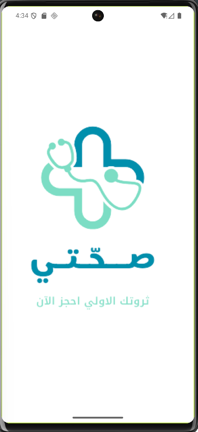
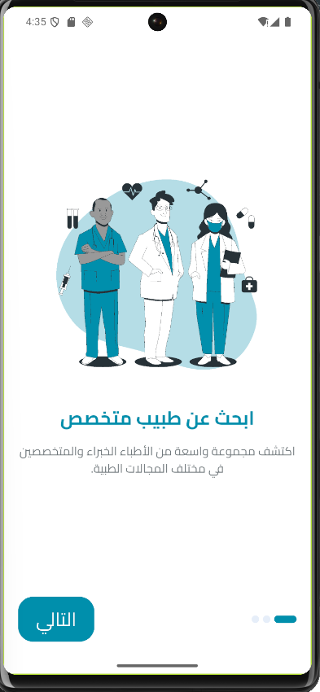
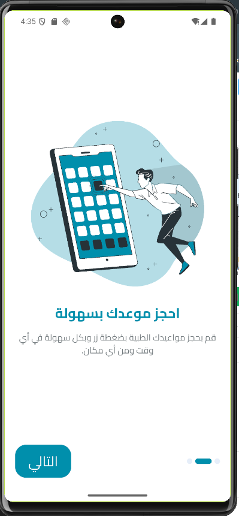
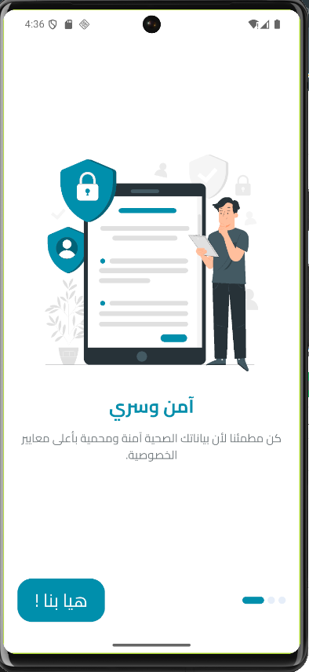
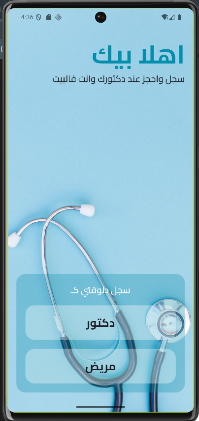
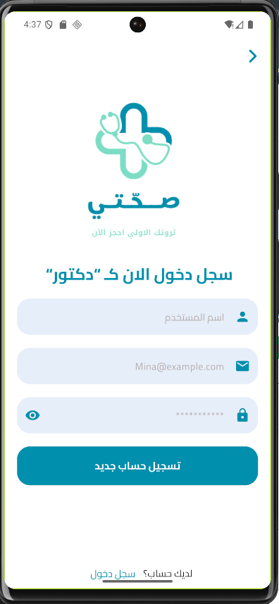
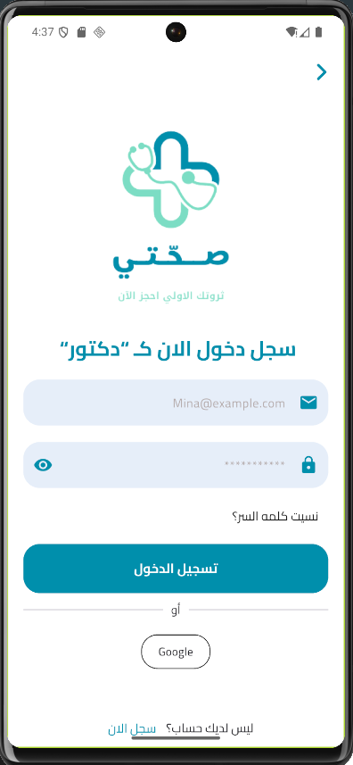
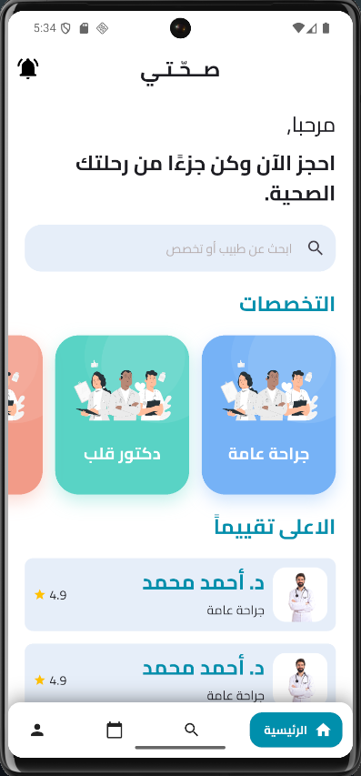

# Se7ety App

Se7ety is a Flutter application built as part of **Session 26** in my Flutter course.

In this session, I moved the project from a pure entry-flow UI into a more functional app by adding **Firebase Authentication**, **Cloud Firestore**, **local persistence with SharedPreferences**, and the first implemented screen of the patient side, which is the **Patient Home Screen**.

The project is organized using a **feature-based structure**, with reusable widgets, centralized styling, `GoRouter` for navigation, and `Cubit` for state management.

---

## Session 26 Scope

This session focused on upgrading the app from static authentication screens into a connected flow with real logic and the first patient-side experience.

Implemented in this session:

- Firebase initialization
- Login with Firebase Authentication
- Register with Firebase Authentication
- Save doctor and patient data in Cloud Firestore
- Form validation for authentication screens
- SharedPreferences for onboarding and login persistence
- Splash screen decision logic
- Patient main app layout with bottom navigation
- Patient home screen UI
- Reusable loading and feedback dialogs

---

## Features

### Splash Screen

- Displays the app logo
- Waits briefly before navigating
- Decides the next screen based on the current app state:
  - If the user is already logged in, it opens the **Patient Main App Screen**
  - If onboarding has already been shown, it opens the **Welcome Screen**
  - Otherwise, it opens the **Onboarding Screen**

### Onboarding Flow

- Built using `PageView`
- Contains 3 onboarding pages
- Uses `Cubit` to track the current page
- Displays a custom onboarding indicator
- Changes the button text on the last page
- Saves onboarding state locally using `SharedPreferences`
- Navigates to the welcome screen after completion

### Welcome Screen

- Introduces the app to the user
- Allows choosing the account type:
  - Doctor
  - Patient
- Passes the selected user type to the authentication screens

### Register Screen

- Displays dynamic text based on the selected user type
- Includes:
  - Name field
  - Email field
  - Password field
- Validates all inputs before submitting
- Creates the account using **Firebase Authentication**
- Stores basic user data in **Cloud Firestore**
- Saves the user ID locally using `SharedPreferences`
- Shows loading and error feedback through reusable dialogs

### Login Screen

- Displays dynamic text based on the selected user type
- Includes:
  - Email field
  - Password field
  - Forgot password button UI
  - Google button placeholder
- Validates form inputs before login
- Logs the user in using **Firebase Authentication**
- Saves the user ID locally using `SharedPreferences`
- Navigates to the patient main layout after success
- Shows loading and error feedback through reusable dialogs

### Authentication Logic

Authentication is managed using `AuthCubit`, which handles:

- Loading state
- Success state
- Error state

This keeps business logic separated from UI and makes the flow easier to maintain.

### Firestore Integration

The app stores user data in separate Firestore collections:

- `doctors`
- `patients`

Two models are prepared for user data:

- `DoctorModel`
- `PatientModel`

These models already include extra fields to support future development and profile expansion.

### Local Persistence

The app uses `SharedPreferences` to store:

- Whether onboarding has already been shown
- The currently logged-in user ID

This improves the user flow and avoids repeating onboarding every time the app opens.

### Patient Main App Layout

A patient-side main layout was added using bottom navigation.

Current tabs:

- Home
- Search
- Appointments
- Profile

At this stage, the **Home** screen is the implemented screen, while the other tabs are placeholder containers prepared for future sessions.

### Patient Home Screen

A new patient home screen was added in this session.

It currently includes:

- App bar with app title and notification icon
- Greeting section
- Search field
- Horizontal specialties section
- Top-rated doctors section
- Reusable specialty cards
- Reusable doctor cards

### Reusable Components

The app continues to use reusable shared widgets and helpers, such as:

- `AppButton`
- `CustomTextFormField`
- `PasswordTextFormField`
- `AuthFooter`
- `UserTypeCard`
- `OnboardingIndicator`
- `OnboardingPageContent`
- `DoctorCard`
- `SpecialtyCard`
- `SpecialtySection`
- `dialogs.dart`

---

## Tech Stack

- Flutter
- Dart
- flutter_bloc
- go_router
- firebase_core
- firebase_auth
- cloud_firestore
- shared_preferences
- easy_localization
- flutter_localizations
- flutter_svg
- google_nav_bar
- lottie
- dartz
- gap

---

## Project Structure

    lib/
    ├── app_root/
    │   └── app_root.dart
    │
    ├── core/
    │   ├── constants/
    │   │   ├── app_fonts.dart
    │   │   └── app_images.dart
    │   ├── functions/
    │   │   ├── app_validators.dart
    │   │   └── navigations.dart
    │   ├── routes/
    │   │   └── routes.dart
    │   ├── service/
    │   │   ├── firebase/
    │   │   │   ├── failuer/
    │   │   │   │   └── failuer.dart
    │   │   │   └── firestore_provider.dart
    │   │   └── local/
    │   │       └── shared_pref.dart
    │   ├── styles/
    │   │   ├── app_colors.dart
    │   │   └── text_styles.dart
    │   └── widgets/
    │       ├── app_button.dart
    │       ├── custom_text_form_field.dart
    │       ├── dialogs.dart
    │       └── password_text_form_field.dart
    │
    ├── features/
    │   ├── auth/
    │   │   ├── data/
    │   │   │   ├── models/
    │   │   │   │   ├── auth_params.dart
    │   │   │   │   ├── doctor_model.dart
    │   │   │   │   └── patient_model.dart
    │   │   │   └── repo/
    │   │   │       └── auth_repo.dart
    │   │   └── presentation/
    │   │       ├── cubit/
    │   │       │   ├── auth_cubit.dart
    │   │       │   └── auth_state.dart
    │   │       ├── screens/
    │   │       │   ├── login/
    │   │       │   │   └── login_screen.dart
    │   │       │   └── register/
    │   │       │       └── register_screen.dart
    │   │       └── widgets/
    │   │           └── auth_footer.dart
    │   │
    │   ├── home/
    │   │   └── presentation/
    │   │       ├── screens/
    │   │       │   └── patient_home_screen.dart
    │   │       └── widgets/
    │   │           ├── doctor_card.dart
    │   │           ├── specialty_card.dart
    │   │           └── specialty_section.dart
    │   │
    │   ├── main/
    │   │   └── patient_main_app_screen.dart
    │   │
    │   └── welcome/
    │       ├── splash/
    │       │   └── screens/
    │       │       └── splash_screen.dart
    │       ├── welcome/
    │       │   ├── screens/
    │       │   │   └── welcome_screen.dart
    │       │   └── widgets/
    │       │       └── user_type_card.dart
    │       └── on_boarding/
    │           ├── data/
    │           │   └── models/
    │           │       └── on_boarding_model.dart
    │           └── presentation/
    │               ├── cubit/
    │               │   ├── on_boarding_cubit.dart
    │               │   └── on_boarding_state.dart
    │               ├── screens/
    │               │   └── on_boarding_screen.dart
    │               └── widgets/
    │                   ├── onboarding_indicator.dart
    │                   └── onboarding_page_content.dart
    │
    ├── firebase_options.dart
    └── main.dart

---

## Navigation Flow

The current user flow is:

**Splash Screen**  
→ **Onboarding** *(first launch only)*  
→ **Welcome Screen**  
→ **Register / Login**  
→ **Patient Main App Screen**  
→ **Patient Home Screen**

Navigation is handled using `GoRouter`.

---

## Validation

The authentication forms currently validate:

- User name
- Email
- Password

Validation logic is centralized in `app_validators.dart` to keep it reusable and clean.

---

## UI and Localization

- The app is currently configured to run in **Arabic**
- The app uses the **Cairo** font
- `EasyLocalization` is initialized in the project setup
- Flutter localization delegates are added
- The UI is designed with a healthcare-oriented Arabic experience

---

## Code Quality Highlights

In this session, I focused on:

- Connecting UI screens to real authentication logic
- Keeping logic separated from UI using Cubit and repository-based organization
- Reusing shared widgets and helper functions
- Centralizing validation and feedback handling
- Improving app flow with splash decision logic and local caching
- Preparing the project for future doctor and patient features

---

## Current Status

### Completed

- Splash screen decision logic
- Onboarding flow with persistence
- Welcome screen with user type selection
- Register screen validation and Firebase integration
- Login screen validation and Firebase integration
- Firestore integration for saving user data
- SharedPreferences integration
- AuthCubit for authentication states
- Patient main app layout
- Patient home screen
- Reusable dialogs and shared widgets

### Planned for Future Sessions

- Real doctor-side main flow
- Search screen implementation
- Appointments flow
- Profile screen implementation
- Forgot password functionality
- Google sign-in
- Dynamic backend-driven home content
- More complete Firestore profile data management

---

## Screenshots

| Splash Screen | Onboarding 1 | Onboarding 2 | Onboarding 3 |
|---|---|---|---|
|  |  |  |  |

| Welcome Screen | Register Screen | Login Screen | Patient Home Screen |
|---|---|---|---|
|  |  |  |  |

---

## What I Learned

Through this session, I practiced:

- Initializing Firebase in Flutter
- Building register and login flows with Firebase Authentication
- Saving user data in Cloud Firestore
- Managing authentication state using Cubit
- Persisting onboarding and user session data locally
- Creating a better first-run and returning-user flow
- Building the first patient-side home UI
- Keeping the code modular and easier to maintain

---

## Conclusion

Session 26 was an important step in making Se7ety feel like a real application instead of just a UI flow.

The project now includes authentication logic, Firestore integration, local persistence, and the first implemented patient screen after login. This gives the app a much stronger base for future expansion and makes the structure more ready for scalable development.